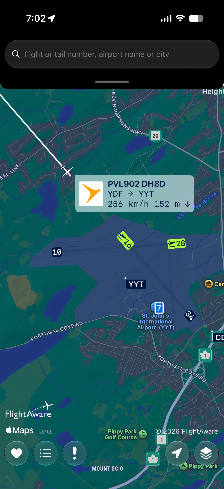
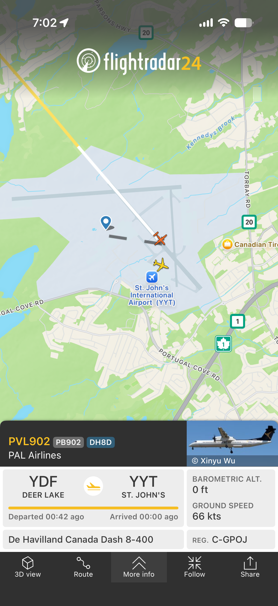
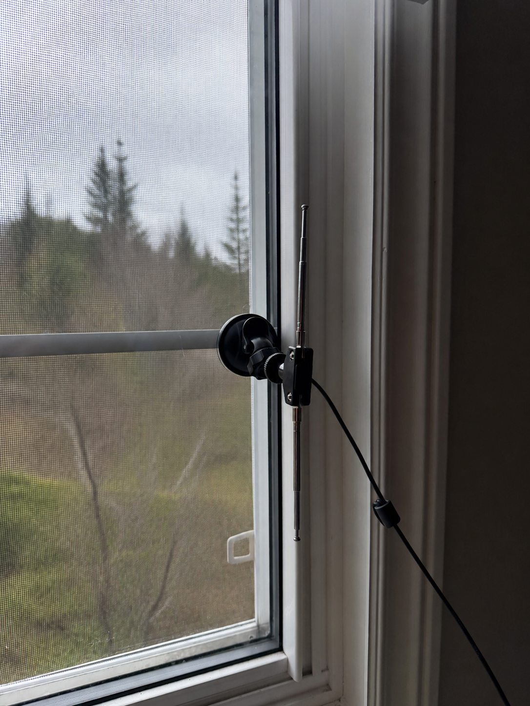
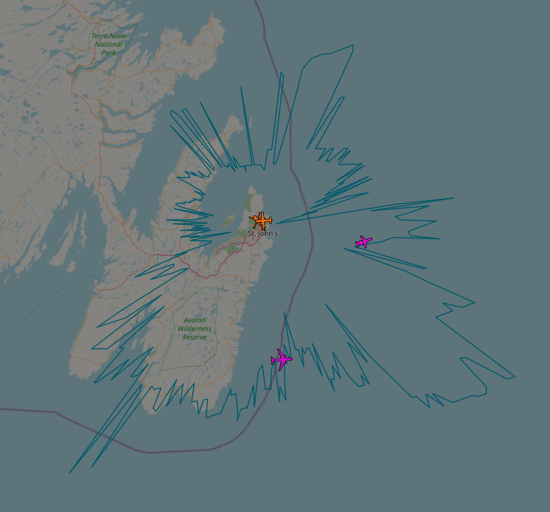
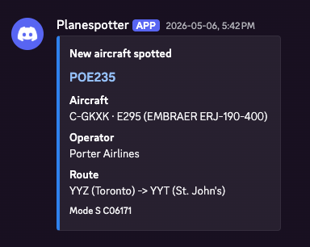
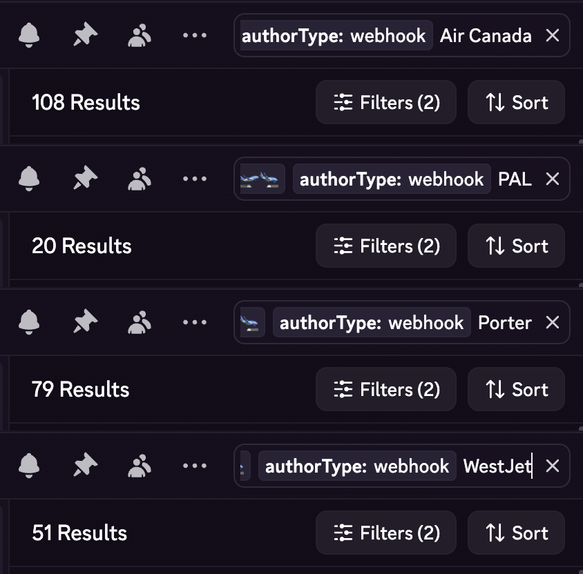
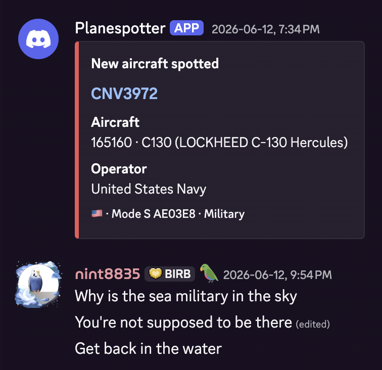
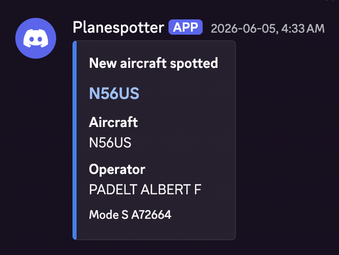
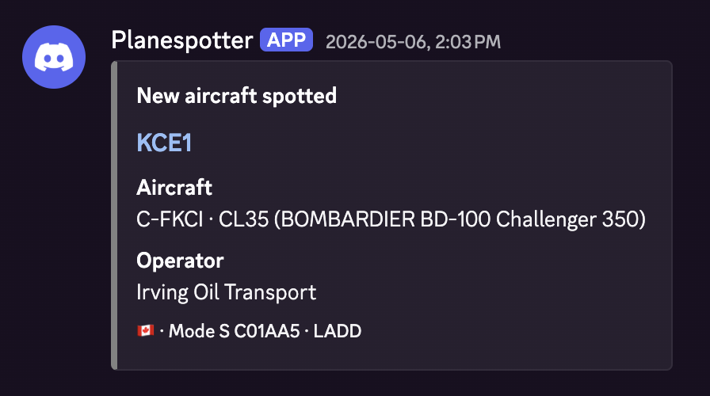
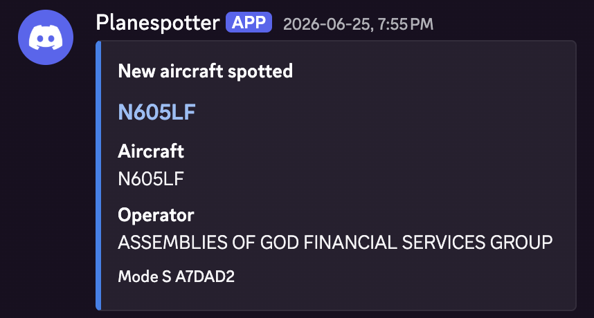

# Planespotter

---
layout: section
sectionNumber: "1"
---

## Inspiration

<template v-slot:descriptor>
How did we get here?
</template>

---
layout: two-images
sectionNumber: "1"

fig1Label: FlightAware
fig2Label: flightradar24
---

## The beginning

- I live within the flight path of the St. John's airport
- A **LOT** of stuff flies over my apartment
- Been an off-and-on user of air traffic tracking apps for a while now

<template v-slot:image1>
    
</template>

<template v-slot:image2>
    
</template>

<style>
    .ti-image-frame img {
        object-fit: contain;
    }
</style>

---
layout: default
sectionNumber: "1"
---

## This has problems

- Requires me to hear something fly overhead -> open the app -> check what it is
  - Might not be able to hear it for any variety of reasons
  - Might be too busy to open the app
- Signal-to-noise ratio is _TERRIBLE_
  - Vast majority of what I hear is the same few Cougar / WestJet / Air Canada / Porter / etc. flights
  - I want to find out about the _interesting_ stuff

---
layout: section
sectionNumber: "2"
---

## The Technology

<template v-slot:descriptor>
There has <i>got</i> to be a better way.
</template>

---
layout: quote
sectionNumber: "2"

attribution: Automatic Dependent Surveillance–Broadcast
rank: Wikipedia
---

"Automatic Dependent Surveillance–Broadcast (ADS-B) is an aviation surveillance technology and form of electronic conspicuity in which an aircraft determines its position via satellite navigation or other sensors and periodically broadcasts its position and other related data, enabling it to be tracked."

---
layout: two-images
sectionNumber: "2"

fig1Label: Highly-sophisticated monitoring setup
fig2Label: Reception range
---

## One hardware donation later...

<template v-slot:image1>
    
</template>

<template v-slot:image2>
    
</template>

---
layout: quote
sectionNumber: "2"

attribution: Pseudo-range multilateration
rank: Wikipedia
---

"Pseudo-range multilateration, often simply multilateration (MLAT) when in context, is a technique for determining the position of an unknown point, such as a vehicle, based on measurement of biased times of flight (TOFs) of energy waves traveling between the vehicle and multiple stations at known locations."

---
layout: image

image: /images/mlat.png
---

---
layout: code-right
sectionNumber: "2"

codeTitle: dump1090 aircraft.json file
codeLang: json
---

## Accessing the data

- Container exposes minimally-processed data from the collector on `/data/aircraft.json`
- ***FAR*** too many tokens of GPT-5.5 medium later...

<template v-slot:code>

```json
{
    "now": 1782523157.0,
    "messages": 2175432,
    "aircraft": [
        {
            "hex": "c01759",
            "type": "adsb_icao",
            "flight": "ACA832  ",
            "r": "C-FIVW",
            "t": "B77W",
            "desc": "BOEING 777-300ER",
            "ownOp": "Air Canada",
            "year": "2013",
            "alt_baro": 35000,
            "alt_geom": 35925,
            "lat": 47.87097,
            "lon": -52.61754
            ...
        }
    ]
}
```

</template>

---
layout: section
sectionNumber: "3"
---

## Planespotter

<template v-slot:descriptor>
A Discord bot for monitoring air traffic.
</template>

---
layout: image-right
sectionNumber: "3"

figLabel: Example post
---

## What does it do?

- Polls the configured tar1090 server every 15 seconds
- Looks for any new aircraft under 10,000 feet
- Enriches the data and posts in Discord

<template v-slot:image>
    
</template>

<style>
    .ir-image-frame img {
        object-fit: contain;
    }
</style>

---
layout: image-right
sectionNumber: "3"

figLabel: Notifications for common airlines
---

## _Far_ more of the usual planes than you'd expect

<template v-slot:image>
    
</template>

---
layout: two-images
sectionNumber: "3"

fig1Label: Military plane
fig2Label: Military aircraft count
---

## Military planes. SO MANY military planes.

<template v-slot:image1>
    
</template>

<template v-slot:image2>
    
</template>

<style>
    .ti-image-frame img {
        object-fit: contain;
    }
</style>

---
layout: two-images
sectionNumber: "3"

fig1Label: The Notification
fig2Label: The aircraft
---

## ...A balloon?

<template v-slot:image1>
    
</template>

<template v-slot:image2>
    
</template>

<style>
    .ti-image-frame img {
        object-fit: contain;
    }
</style>

---
layout: two-images
sectionNumber: "3"

fig1Label: Of course the irvings have private jets
fig2Label: ...What?
---

## Some expected things, some less expected things

<template v-slot:image1>
    
</template>

<template v-slot:image2>
    
</template>

<style>
    .ti-image-frame img {
        object-fit: contain;
    }
</style>

---
layout: end
---

<template v-slot:title>Questions?</template>

<template v-slot:contact>

<mdi-github/> `nint8835/planespotter`<br/>

</template>
